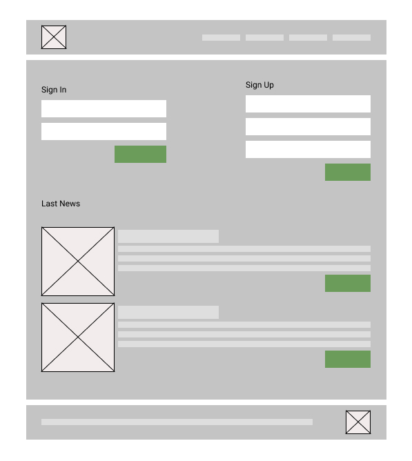
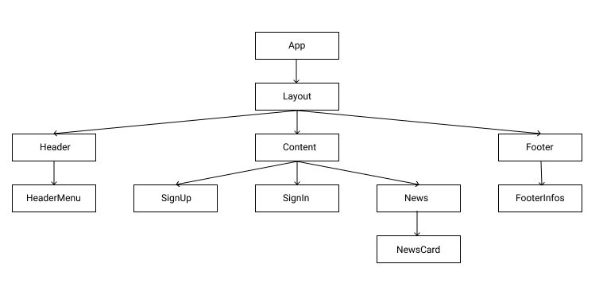

# GuideLine front en react typescript app

- Knowlage
- Get Started
- Create a ReactJS Component.
- Style a component using bootstrap.
  - bootstrap integration
  - custom styles
- Create a Store using Easy Peasy
- Fetch data from API
- Audit Performances

## Knowlage

- HTML,
- CSS
- JavaScript
- ReactJs
- TypeScript
- BootStrap

## How to split UI to components

Before getting into coding see how you can split your app into multiple smaller components.
React is just about Component modulations, you need to segregate your components in hierarchical format which states parent child relationships.

<figure>
  <figcaption>Guideline Exemple</figcaption>
  
</figure>
<figure>
  <figcaption>Guideline Exemple Split</figcaption>
  
</figure>
<figure>
  <figcaption>Guideline Components Hierarchy</figcaption>
  
</figure>

## Codding

in this section we will take the News component as an example.

### Guive a unique name to your component

the name should be clear and unique in the application, in order to make them being easier to find and to avoid possible confusions.
, follow the pattern path-based-component-naming, accordingly to its relative path. For exemple, a component that is located at: components/parent/child.container.tsx would be named as ParentChildContainer. This will Facilitate the search for the file inside the project and Avoid repeating names on the imports.

### split your code

to create a component, we need to handle datas, views, actions, enents , typescript definitions, styles, tests ... this is why it will be a good idea to split our code to different files. and then we add an index witch will export for us the final component.

#### exemple of component structure

```
name
  ├── name.style.css
  ├── name.component.tsx
  ├── name.hook.ts
  ├── name.container.tsx
  ├── name.template.ts
  ├── name.store.ts
  ├── name.injection.ts
  ├── name.type.ts
  ├── name.test.tsx
  └── index.ts
```

- you are free to use other names like view instead of component , interface in place of type. the important is to use a name that match with the content.
- you can use capital letters to name the files,(Name in place of name) but remember that we most use Capital letters to name Classes and instances of react components not the file,

### 1- Start With A Mock

One of the many great parts of React is how it makes you think about apps as you build them.
Imagine that we already have a JSON API and a mock from our designer.

If we take the News Component the template looks like this:

```javascript
// /src/components/news/news.template.ts

export default {
  title: "",
  news: {
    img: {
      url: "",
      alt: ""
    },
    title: "",
    link: "",
    description: ""
  }
};
```

- Remember to talk with ux and back-end developers so you can have an idea of the data that you will recive
- You can use json or js, remember this is only a mocked template it can be replaced by a store state or fetched data. or you can keep it as a static data.

### 2- Create typescript types

Using TypeScript allows us to get the benefits of IntelliSense, as well as the ability to further reason about our code. As well as this, adopting TypeScript is easy as files can be incrementally upgraded without causing issues throughout the rest of your project.

If we take the News Component the typescript file looks like this:

```typescript
// /src/components/news/news.type.ts
export interface INewsItemImage {
  url: string;
  alt: string;
}
export interface INewsItem {
  img?: INewsItemImage;
  title: string;
  link: string;
  description: string;
}
export interface INews {
  title: string;
  news: INewsItem[];
}
```

- use I before evry interface you create.
- put only types that is relative to news component, if there is a common interface you can put it in src/types/ folder.

### 3- Create a test file

Start with a test file: under ./src/components/name/name.test.tsx. the test file is very important for TDD. we are using Jest with react-testing-library, https://testing-library.com/docs/react-testing-library/intro is a good reference to learn how to code tests.
To write maintainable tests for your component, tests must avoid including implementation details of your component, and rather focus on making tests give you the confidence for which they are intended. As part of this, testbase will be maintainable in the long run.

In our example the test file looks like this:

### Create a ReactJS Component.

there is two way today to create a react component, by using a Class or a Function.
in this gudeline we will use Functions

## Get Started

```
npx create-react-app my-app --template typescript
```

For Coverage Tests

```json
{
  "scripts": {
    "test:coverage": "react-scripts test --coverage"
  },
  "jest": {
    "collectCoverageFrom": [
      "**/*.{js,jsx}",
      "!**/node_modules/**",
      "!**/vendor/**"
    ]
  }
}
```

- Apllication structure

```
my-app
├── build
├── node_modules
├── public
│ ├── favicon.ico
│ ├── index.html
│ ├── manifest.json
│ └── images
│   └── ...
├── src
│ ├── components
│ │ └── ...
│ ├── types
│ ├── pages
│ │ └── ...
│ ├── utils
│ │ ├── ...
│ │ └── index.js
│ ├── index.css
│ ├── index.js
│ ├── react-app-env.d.ts
│ ├── serviceWorker.js
│ └── setupTests.ts
├── .gitignore
├── package.json
├── tsconfig.json
└── README.md
```
