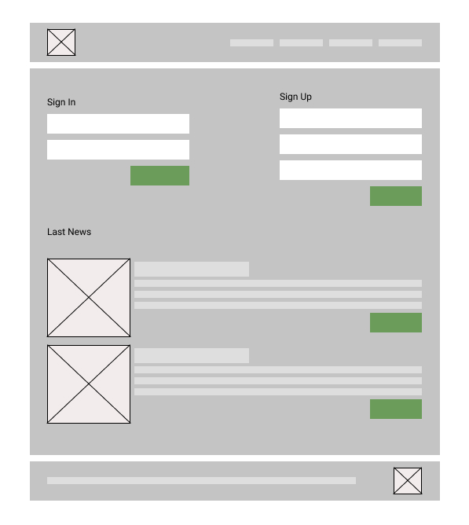
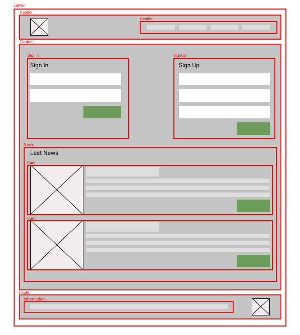
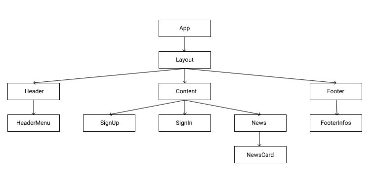

# GuideLine front en react typescript app

- Knowlage
- Get Started
- Create a ReactJS Component.
- Style a component using bootstrap.
  - bootstrap integration
  - custom styles
- Create a Store using Easy Peasy
- Fetch data from API
- Audit Performances

## Knowlage

JavaScript
ReactJs
TypeScript
BootStrap

## How to split UI to components

Before getting into coding see how you can split your app into multiple smaller components.
React is just about Component modulations, you need to segregate your components in hierarchical format which states parent child relationships.

<figure>
  <figcaption>Guideline Exemple</figcaption>
  
</figure>
<figure>
  <figcaption>Guideline Exemple Split</figcaption>
  
</figure>
<figure>
  <figcaption>Guideline Exemple Components</figcaption>
  
</figure>

### Guive a unique name to your component

the name should be clear and unique in the application, in order to make them being easier to find and to avoid possible confusions.
, follow the pattern path-based-component-naming, accordingly to its relative path. For exemple, a component that is located at: components/parent/child.container.tsx would be named as ParentChildContainer. This will Facilitate the search for the file inside the project and Avoid repeating names on the imports.

## Codding

### split your code

to create a component, we need to handle datas, views, actions, enents , typescript definitions, styles, tests ... this is why it will be a good idea to split our code to different files. and then we add an index witch will export for us the final component.

#### exemple of component structure

```
name
  ├── name.style.css
  ├── name.component.js
  ├── name.hook.js
  ├── name.container.js
  ├── name.template.js
  ├── name.store.js
  ├── name.injection.js
  ├── name.type.js
  ├── name.test.js
  └── index.js
```

- you are free to use other names like view instead of component , interface in place of type. the important is to use a name that match with the content.
- you can use capital letters to name the files,(Name in place of name) but remember that we most use Capital letters to name Classes and instances of react components not the file,

## Create a ReactJS Component.

there is two way today to create a react component, by using a Class or a Function.
in this gudeline we will use Functions

Start with a test file: under ./src/components/name/name.test.tsx. the test file is very important for TDD. we are using Jest with react-testing-library, https://testing-library.com/docs/react-testing-library/intro is a good reference to learn how to code tests.

## Get Started

```
npx create-react-app my-app --template typescript
```

For Coverage Tests

```json
{
  "scripts": {
    "test:coverage": "react-scripts test --coverage"
  },
  "jest": {
    "collectCoverageFrom": [
      "**/*.{js,jsx}",
      "!**/node_modules/**",
      "!**/vendor/**"
    ]
  }
}
```

- Apllication structure

```
my-app
├── build
├── node_modules
├── public
│ ├── favicon.ico
│ ├── index.html
│ ├── manifest.json
│ └── images
│   └── ...
├── src
│ ├── components
│ │ └── ...
│ ├── pages
│ │ └── ...
│ ├── utils
│ │ ├── ...
│ │ └── index.js
│ ├── index.css
│ ├── index.js
│ ├── react-app-env.d.ts
│ ├── serviceWorker.js
│ └── setupTests.ts
├── .gitignore
├── package.json
├── tsconfig.json
└── README.md
```
